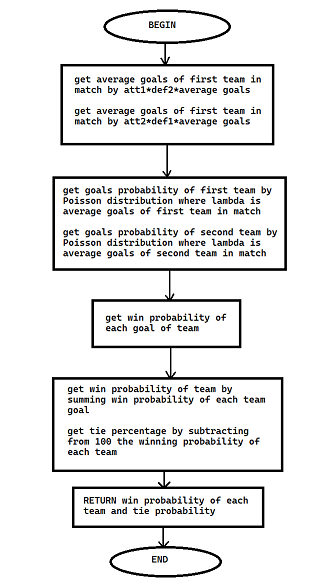
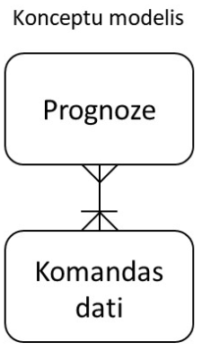
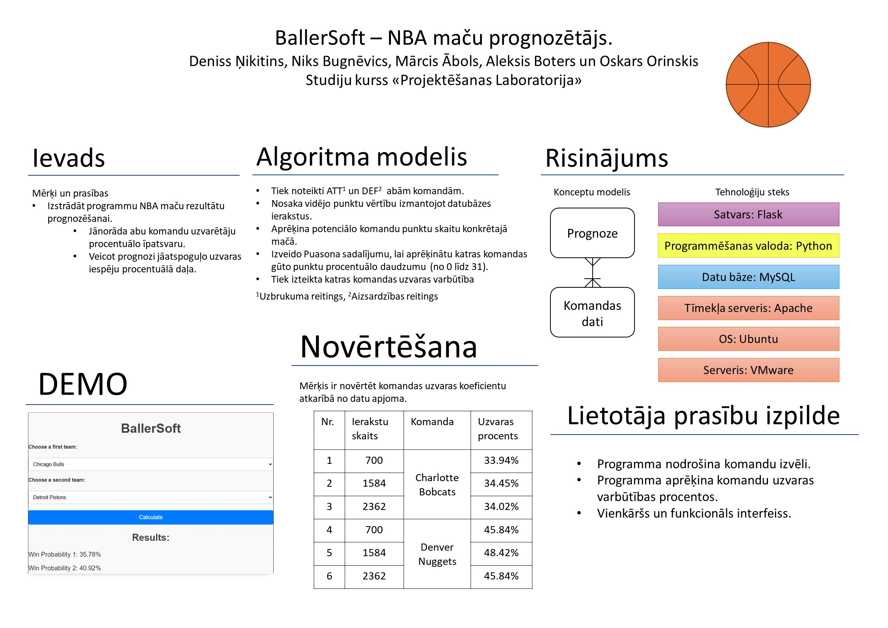

# Basketbola Spēles Rezultāta Prognozēšana

## Dalībnieki:
- **Niks Bugnēvics**
- **Aleksis Boters**
- **Oskars Orinskis**
- **Mārcis Ābols**
- **Deniss Ņikitins**

---

## Ievads

### Problēmas nostādne
Basketbols ir plaši populārs sporta veids, un daudzus interesē spēļu iznākumu prognozēšana. Tomēr ne visi spēj precīzi noteikt, kura komanda uzvarēs. Tas rada nepieciešamību pēc rīka, kas spēj veikt šo uzdevumu automātiski.

### Darba un novērtēšanas mērķis
Izstrādāt un realizēt tehnisku risinājumu, kas palīdzētu lietotājiem prognozēt basketbola spēļu rezultātus, balstoties uz komandu datiem un spēļu vēsturi.

---

## Tehniskais risinājums

### Prasības
Basketbola fans vēlas:
- Automātiski iegūt prognozi par spēli starp divām komandām, izvairoties no manuāliem aprēķiniem.
- Saņemt informāciju par:
  - Abu komandu uzvaras procentuālo iespēju.
  - Izlozes procentuālo iespēju.

---

## Algoritms
1. Definēt komandu **ATT** (uzbrukuma spējas) un **DEF** (aizsardzības spējas).
2. Aprēķināt vidējo punktu skaitu, balstoties uz datu bāzes ierakstiem.
3. Katras komandas gadījumā aprēķināt iespējamā punktu skaita vidējo vērtību konkrētajā spēlē.
4. Izmantojot Puasona sadalījumu, noteikt katras komandas gūto punktu sadalījumu (no 0 līdz 31 punktam).
5. Aprēķināt katras komandas uzvaras un izlozes varbūtību.

---

### Pseidokods
```
BEGIN PREDICTION
    get att1, def1, att2, def2, average_goals
    calculate avg_goals_team1 = att1 * def2 * average_goals
    calculate avg_goals_team2 = att2 * def1 * average_goals
    calculate prob_goals_team1 = Poisson(avg_goals_team1)
    calculate prob_goals_team2 = Poisson(avg_goals_team2)
    calculate win_prob_team1
    calculate win_prob_team2
    calculate tie_prob = 100 - win_prob_team1 - win_prob_team2
RETURN win_prob_team1, win_prob_team2, tie_prob
END PREDICTION
```
**Blokshēma**



---

## Konceptuālais modelis

Konceptuālajā modelī ir divas galvenās tabulas:
1. **Prognozes**:
   - Glabā visas veiktās prognozes.
   - Saistītas ar komandas datiem (daudz-pret-daudz attiecības).
2. **Komandu dati**:
   - Satur vēsturisko informāciju par katras komandas sniegumu.

Šis modelis nodrošina prognožu ģenerēšanu, izmantojot vēsturiskos datus.



---

## Novērtējums

### Novērtēšanas plāns
**Mērķis:** Novērtēt komandu uzvaras procentu atkarībā no datu apjoma.

#### Ieejas mainīgie:
- **Datu ierakstu skaits**: 700, 1584, 2362 ieraksti.
- **Komandas**: Atlanta Hawks, Boston Celtics.

#### Novērtēšanas mērs:
- Uzvaras varbūtība.

---

### Novērtēšanas rezultāti
| Nr. | Ierakstu skaits | Komanda          | Uzvaras varbūtība |
|-----|-----------------|------------------|-------------------|
| 1   | 700             | Charlotte Bobcats| 33.94%           |
| 2   | 1584            | Charlotte Bobcats| 34.45%           |
| 3   | 2362            | Charlotte Bobcats| 34.02%           |
| 4   | 700             | Denver Nuggets   | 45.84%           |
| 5   | 1584            | Denver Nuggets   | 48.42%           |
| 6   | 2362            | Denver Nuggets   | 45.84%           |

---
### Plakāts


